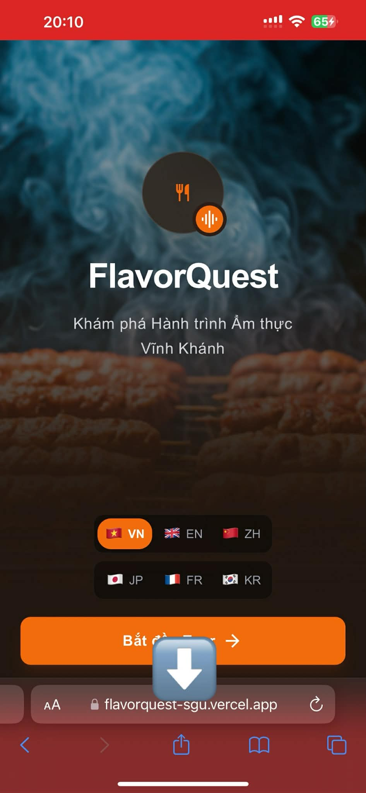
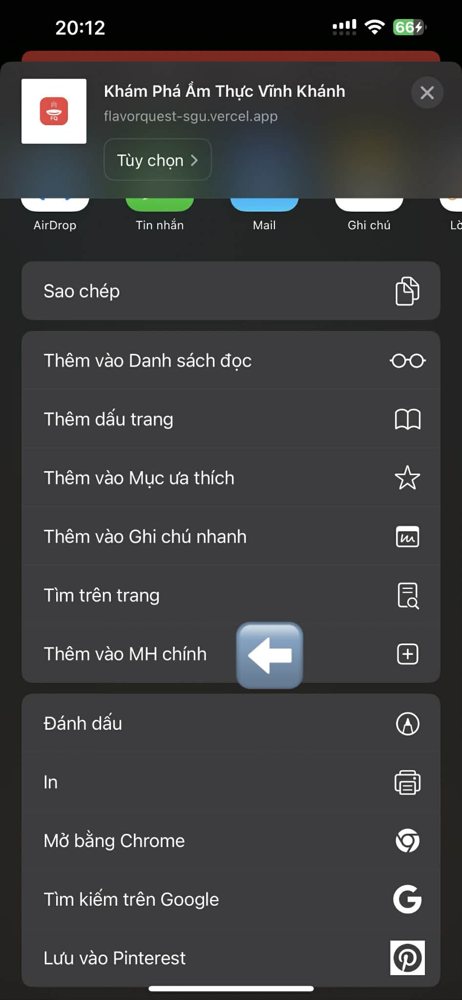
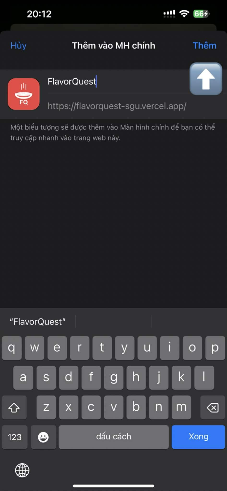
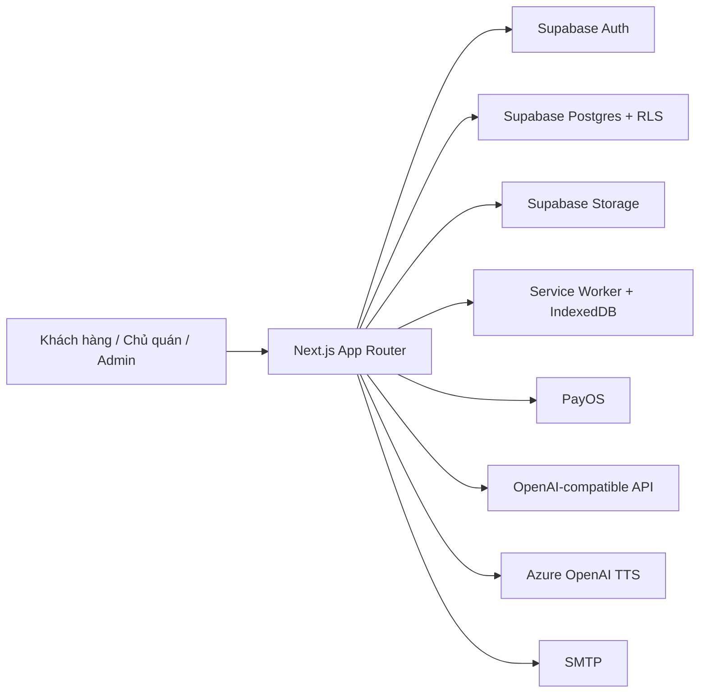

# FlavorQuest

<p align="center">
  
</p>

<p align="center">
  <strong>Nền tảng khám phá ẩm thực đường phố Vĩnh Khánh bằng bản đồ, âm thanh, dữ liệu vị trí và trải nghiệm đa vai trò.</strong>
</p>

<p align="center">
  FlavorQuest không chỉ là một website giới thiệu địa điểm ăn uống. Đây là một PWA được thiết kế như một lớp dẫn tour số cho phố ẩm thực: khách mở ứng dụng, chọn ngôn ngữ, đi bộ giữa các điểm ăn, nghe thuyết minh theo vị trí, đặt món trước, trò chuyện hỗ trợ, mở khóa nội dung bằng thanh toán và quay lại trải nghiệm ngay cả khi kết nối chập chờn.
</p>

<p align="center">
  
  
  
  
  
</p>

## Toàn cảnh sản phẩm

FlavorQuest đang được tổ chức thành bốn lớp trải nghiệm chính:

- Khách hàng đi tour bằng bản đồ, danh sách hoặc trợ lý AI, có thể nghe audio tự động theo vị trí, xem lịch sử, tải nội dung offline và nhận thông báo.
- Khách hàng chỉ vào được khu tour sau khi xác thực OTP và mở khóa quyền truy cập qua PayOS.
- Chủ quán có dashboard riêng để theo dõi POI được gán, quản lý món, xử lý đơn đặt trước và đọc thông báo.
- Admin có trung tâm điều hành để quản trị POI, tour, người dùng, yêu cầu lên owner, thanh toán, phân tích và hỗ trợ vận hành.

Điểm nổi bật nhất của codebase này là cách các phần sản phẩm nối vào nhau rất rõ: bản đồ và geofence phục vụ trải nghiệm khách, analytics và notifications giữ nhịp vận hành, còn các lớp quyền truy cập bảo đảm mỗi vai trò nhìn thấy đúng khu vực của mình.

## Hình dung nhanh

<p align="center">
  
  
  
</p>

## Điều làm FlavorQuest khác biệt

- Dẫn tour theo vị trí thật: geofence, lọc nhiễu GPS, tính tốc độ di chuyển, chống phát lặp bằng cooldown.
- Trải nghiệm audio nghiêm túc: hàng đợi phát, mini player, phát thủ công hoặc tự động, fallback sang TTS khi thiếu file âm thanh.
- PWA đúng nghĩa: service worker, preload audio và hình ảnh, cache nhiều tầng, đồng bộ analytics nền.
- Đa ngôn ngữ ở mức dữ liệu: POI, tour, mô tả và audio được tổ chức cho `vi`, `en`, `ja`, `fr`, `ko`, `zh`.
- Mô hình kinh doanh rõ ràng: paywall mở khóa nội dung khách hàng, chủ quán quản lý món và đơn, admin quan sát toàn hệ thống.
- AI không đứng ngoài sản phẩm: trợ lý theo ngữ cảnh khách, owner và admin đều được cấp ngữ cảnh dữ liệu khác nhau trước khi trả lời.

## Bề mặt tính năng

### 1. Trải nghiệm khách hàng

- Trang chào với chọn ngôn ngữ, phong cách splash screen và cài PWA trên di động.
- Đăng nhập bằng email OTP qua Supabase.
- Paywall mở khóa tài khoản khách với PayOS.
- Tour chính tại `/tour` với:
  - Bản đồ Leaflet.
  - Danh sách POI.
  - Bộ lọc theo tour.
  - Chế độ tự động hoặc thủ công.
  - Thông báo, lịch sử nghe, cài đặt, trạng thái offline.
- Trợ lý AI tại `/tour/assistant`.
- Hộp thư hỗ trợ tại `/tour/chat`.
- Chi tiết POI tại `/tour/[poiId]`.

### 2. Khu vực chủ quán

- Dashboard riêng tại `/owner`.
- Quản lý POI được gán.
- Thêm và xóa món trong thực đơn.
- Theo dõi đơn đặt trước theo trạng thái.
- Nhận thông báo hệ thống và thông báo đơn hàng.
- Trò chuyện hỗ trợ với admin hoặc khách tùy ngữ cảnh.

### 3. Khu vực quản trị

- Dashboard tổng quan tại `/admin`.
- Các màn hình chuyên biệt:
  - `/admin/analytics`
  - `/admin/chat`
  - `/admin/owner-requests`
  - `/admin/payments`
  - `/admin/pois`
  - `/admin/tours`
  - `/admin/users`
- Realtime presence và làm mới dữ liệu qua Supabase Realtime.
- Điều phối yêu cầu lên vai trò owner.

### 4. Hệ thống nền

- Analytics cho các sự kiện nghe audio, bỏ qua, bắt đầu tour, kết thúc tour.
- Notifications theo người dùng.
- Hỗ trợ chat giữa khách, owner và admin.
- Gửi email qua SMTP cho đơn hàng mới và tin nhắn hỗ trợ.
- Dịch nội dung sang nhiều ngôn ngữ qua API tương thích OpenAI.
- Sinh audio TTS qua Azure OpenAI TTS.

## Kiến trúc ở mức cao



### Các thành phần đáng chú ý trong mã nguồn

- `app/`: toàn bộ route App Router cho khách, owner, admin và API.
- `components/`: chia theo miền `tour`, `layout`, `admin`, `ai`, `chat`, `ui`.
- `lib/hooks/`: geolocation, geofencing, audio player, offline sync, quản lý POI và tour.
- `lib/services/`: analytics, chatbot, dịch, audio, mailer, PWA, storage, TTS.
- `lib/contexts/`: auth, ngôn ngữ và trạng thái ứng dụng.
- `supabase/`: schema, seed, migration và tài liệu thiết lập storage.
- `locales/`: 6 file locale cho giao diện khách hàng.
- `public/sw.js`: service worker cho cache, preload và background sync.
- `proxy.ts`: lớp chặn route theo vai trò và trạng thái thanh toán.

## Luồng quyền truy cập

| Vai trò | Cách vào hệ thống | Khu vực chính | Ràng buộc |
| --- | --- | --- | --- |
| Khách hàng | Email OTP | `/paywall`, `/tour`, `/tour/assistant`, `/tour/chat` | Phải mở khóa quyền truy cập trước khi vào `/tour` |
| Pending owner | Email OTP loại owner | `/pending-owner` | Chờ admin duyệt |
| Owner | Email OTP + đã duyệt | `/owner`, `/owner/chat` | Chỉ thấy dữ liệu POI được gán |
| Admin | Đăng nhập admin | `/admin/*` | Tách riêng khỏi cổng khách và owner |

`proxy.ts` đang là một trong những file quan trọng nhất của dự án vì nó ép luồng điều hướng theo trạng thái thực của người dùng: chưa đăng nhập, chưa thanh toán, đang chờ duyệt owner hay đã là admin.

## Mô hình dữ liệu

Schema Supabase hiện thể hiện rất rõ tham vọng của sản phẩm. Các bảng nổi bật gồm:

- `users`: lưu vai trò, trạng thái mở khóa khách hàng và trạng thái yêu cầu owner.
- `pois`: dữ liệu địa điểm với trường đa ngôn ngữ, audio, hình ảnh, món đặc trưng và tọa độ.
- `tours`: tập hợp nhiều POI thành một hành trình.
- `dishes`: món ăn theo từng POI.
- `preorder_orders` và `preorder_order_items`: đơn đặt trước và chi tiết món.
- `customer_access_payments`: lịch sử giao dịch mở khóa tài khoản.
- `notifications`: thông báo theo người dùng.
- `support_threads`, `support_messages`, `support_thread_reads`: hộp thư hỗ trợ.
- `analytics_logs`: nhật ký phân tích hành vi.
- `chat_conversations`, `chat_messages`: lịch sử hội thoại AI theo không gian làm việc.

Seed hiện có 12 POI cho khu phố Vĩnh Khánh, đủ để dựng và trình diễn một vòng trải nghiệm hoàn chỉnh.

## Công nghệ đang dùng

| Lớp | Công nghệ |
| --- | --- |
| Giao diện | Next.js 16, React 19, Tailwind CSS 4 |
| Bản đồ | Leaflet, React Leaflet |
| Xác thực và dữ liệu | Supabase SSR, Supabase Auth, Postgres, Storage, Realtime |
| Thanh toán | PayOS |
| AI | OpenAI SDK với `OPENAI_BASE_URL` tùy biến |
| TTS | Azure OpenAI TTS |
| Email | Nodemailer |
| Offline | Service Worker, IndexedDB qua `idb-keyval` |
| Kiểu dữ liệu | TypeScript strict mode |

## API nội bộ

Nhìn từ `app/api`, dự án đã có một bề mặt API tương đối dày:

- Auth: callback OAuth, chuẩn bị và hoàn tất email OTP.
- POI, tour, dish, order, users: CRUD và dữ liệu nghiệp vụ.
- Analytics: batch logging và summary.
- Notifications: đọc, đánh dấu đã đọc.
- Payments: tạo giao dịch, kiểm tra trạng thái, nhận webhook, xem lịch sử.
- Support: thread, message, read state.
- AI: chatbot, translate, TTS generate.
- Upload: tải file cho nội dung vận hành.

## Bắt đầu phát triển

### Yêu cầu môi trường

- Node.js 20 trở lên.
- npm.
- Một project Supabase đã bật Auth, Database và Storage.
- Tài khoản PayOS nếu muốn kiểm thử paywall.
- SMTP nếu muốn gửi mail.
- Dịch vụ AI tương thích OpenAI và khóa Azure nếu muốn dùng dịch và TTS.

### Cài đặt

```bash
npm install
```

Sao chép file môi trường:

```powershell
Copy-Item .env.local.example .env.local
```

### Các biến môi trường quan trọng

| Nhóm | Biến |
| --- | --- |
| Supabase | `NEXT_PUBLIC_SUPABASE_URL`, `NEXT_PUBLIC_SUPABASE_ANON_KEY`, `SUPABASE_SERVICE_ROLE_KEY` |
| Ứng dụng | `NEXT_PUBLIC_APP_URL`, `NEXT_PUBLIC_APP_NAME`, `ADMIN_EMAILS` |
| Cờ tính năng | `NEXT_PUBLIC_ENABLE_OFFLINE_MODE`, `NEXT_PUBLIC_ENABLE_TTS_FALLBACK`, `NEXT_PUBLIC_ENABLE_ANALYTICS` |
| AI | `OPENAI_API_KEY`, `OPENAI_BASE_URL`, `OPENAI_MODEL`, `AZURE_API_KEY` |
| Email | `MAIL_FROM_ADDRESS`, `MAIL_FROM_NAME`, `MAIL_HOST`, `MAIL_PORT`, `MAIL_USERNAME`, `MAIL_PASSWORD`, `MAIL_ENCRYPTION` |
| PayOS | `PAYOS_CLIENT_ID`, `PAYOS_API_KEY`, `PAYOS_CHECKSUM_KEY` |

Lưu ý:

- `OPENAI_BASE_URL` cho thấy dự án đang hỗ trợ endpoint tương thích OpenAI chứ không khóa cứng vào một nhà cung cấp duy nhất.
- Local `http://localhost` vẫn được tính đến trong paywall, còn khi thử geolocation trên thiết bị thật nên dùng HTTPS.
- Geolocation ngoài `localhost` trên HTTP sẽ bị trình duyệt chặn.

### Dựng cơ sở dữ liệu

Bạn có thể đi theo một trong hai cách:

1. Chạy tuần tự các file trong `supabase/migrations/`.
2. Hoặc dùng `supabase/schema.sql` để tham chiếu cấu trúc hiện tại, sau đó import `supabase/seed.sql`.

Sau đó:

- Làm theo `supabase/STORAGE_SETUP.md` để tạo bucket audio và images.
- Nếu cần tài liệu chi tiết hơn cho migration, xem `supabase/MIGRATION_INSTRUCTIONS.md`.

### Chạy dự án

```bash
npm run dev
```

Mặc định ứng dụng chạy tại `http://localhost:3000`.

## Kịch bản trải nghiệm đề xuất khi demo

1. Mở trang chủ, chọn ngôn ngữ và cài PWA trên điện thoại.
2. Đăng nhập email OTP ở vai trò khách hàng.
3. Thực hiện mở khóa bằng paywall.
4. Vào `/tour`, chọn hành trình và thử chuyển giữa map, list, assistant, chat.
5. Kiểm tra offline prompt và preload audio.
6. Đăng nhập owner để xem quản lý món và đơn đặt trước.
7. Đăng nhập admin để xem analytics, payments, owner requests và chat.

## Cấu trúc thư mục

```text
app/
  admin/                Giao diện quản trị
  api/                  API route cho auth, dữ liệu, AI, payment, support
  login/                Đăng nhập OTP
  owner/                Khu vực chủ quán
  paywall/              Mở khóa tài khoản khách
  tour/                 Trải nghiệm tour của khách
components/
  admin/                Thành phần dashboard quản trị
  ai/                   Thành phần trợ lý AI
  chat/                 Thành phần hộp thư hỗ trợ
  layout/               Điều hướng, cài đặt, trạng thái offline
  tour/                 Bản đồ, player, POI, selector
  ui/                   Thành phần nền
lib/
  contexts/             Auth, app state, language
  hooks/                Hook nghiệp vụ
  server/               Tích hợp phía server như PayOS, support
  services/             Analytics, audio, chatbot, mailer, PWA, translator, TTS
  supabase/             Client SSR và admin
  utils/                Distance, speed, cooldown, localization
locales/                6 file ngôn ngữ
public/                 Icon, ảnh, service worker
supabase/               Schema, seed, migration, tài liệu storage
tests/                  Khung thư mục test, hiện chưa có ca kiểm thử thực thi
```

## Ghi chú vận hành

- `public/sw.js` triển khai cache riêng cho app shell, audio, hình ảnh, tile bản đồ và dữ liệu động.
- `lib/services/chatbot.ts` xây prompt khác nhau cho khách, owner và admin, đồng thời bơm thêm ngữ cảnh thật từ dữ liệu hệ thống trước khi gọi mô hình.
- `lib/server/payos.ts` đang đặt giá mở khóa khách hàng là `20.000 VND`.
- `app/layout.tsx` dùng `Be Vietnam Pro` làm phông chữ chính, đồng thời cấu hình metadata và manifest khá đầy đủ cho PWA.
- `next.config.ts` đã bật security headers, tối ưu ảnh và `optimizePackageImports` cho `leaflet` và `react-leaflet`.

## Thực trạng chất lượng hiện tại

Điểm mạnh:

- Cấu trúc dự án rõ ràng theo miền nghiệp vụ.
- Dữ liệu và quyền truy cập được thiết kế khá chặt.
- Hệ thống đã vượt xa mức một bản demo tĩnh, có đầy đủ xương sống cho triển khai thật.

Điểm cần biết:

- Thư mục `tests/` mới là khung sẵn, chưa có test case tự động thực thi.
- Một vài nội dung trong repo còn dấu hiệu mã hóa ký tự chưa sạch hoàn toàn, nhất là ở tài liệu cũ và một số chuỗi tiếng Việt.
- Việc vận hành trọn vẹn cần phụ thuộc đúng cấu hình Supabase, PayOS, SMTP và dịch vụ AI.

## Tài liệu tham khảo trong repo

- `docs/phase-1-summary.md`
- `docs/phase-2-summary.md`
- `docs/phase-2-completion.md`
- `supabase/MIGRATION_INSTRUCTIONS.md`
- `supabase/STORAGE_SETUP.md`

## Kết

FlavorQuest là một codebase có cá tính rất rõ: nó đứng ở giao điểm của du lịch vi mô, ẩm thực đường phố, bản đồ, audio, thanh toán và AI hỗ trợ vận hành. Nếu bạn đang tìm một dự án vừa có chất sản phẩm, vừa có nhiều bề mặt kỹ thuật đáng khai thác, đây là một nền tảng rất giàu tiềm năng để tiếp tục mở rộng.
