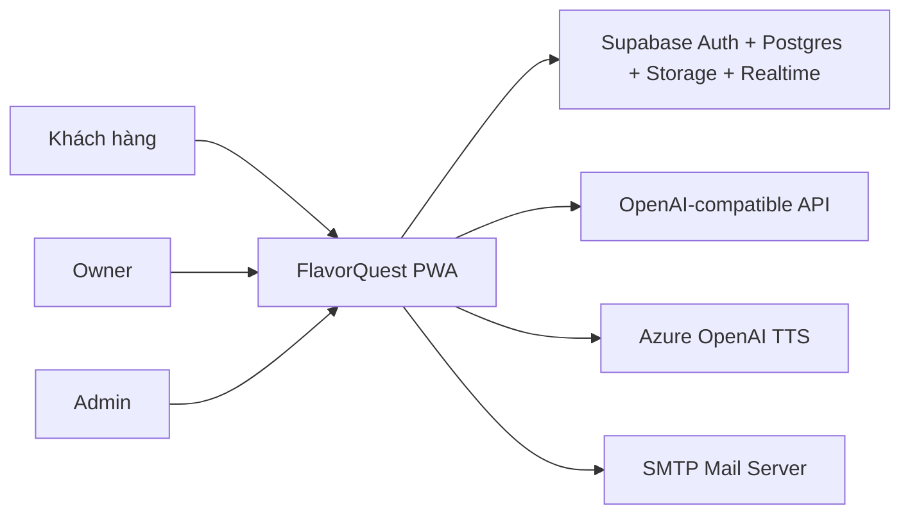
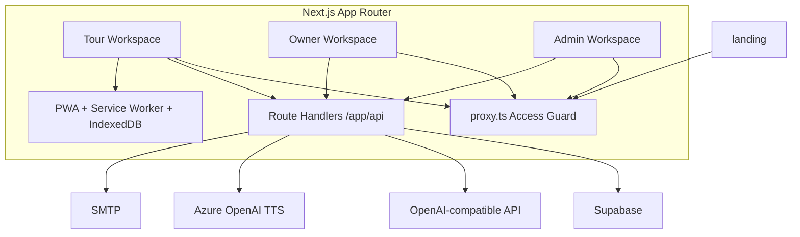
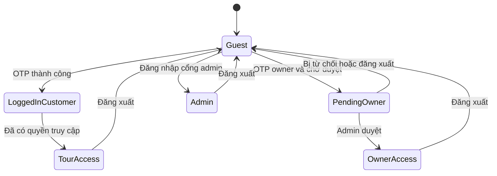
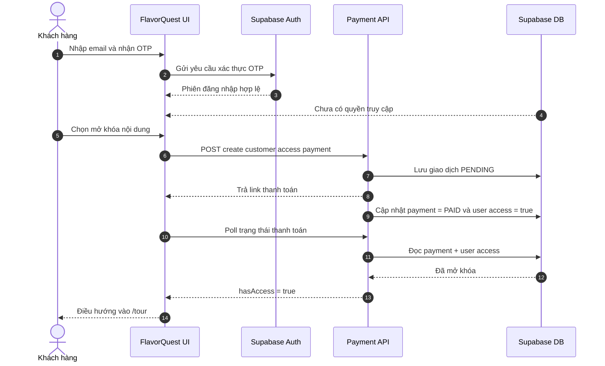
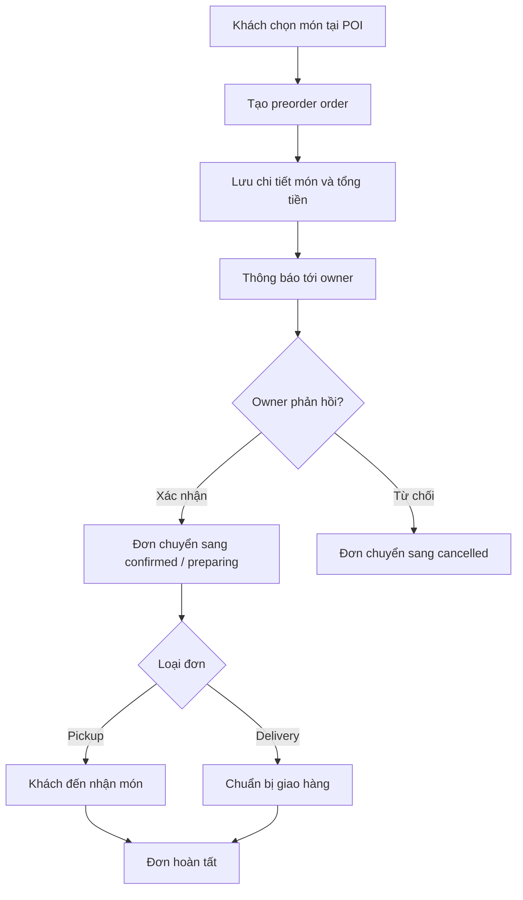

# FlavorQuest Diagrams

Tài liệu này tập hợp các sơ đồ Mermaid để đưa trực tiếp vào báo cáo seminar, slide thuyết trình hoặc tài liệu thiết kế. Các sơ đồ bám theo kiến trúc và luồng nghiệp vụ trong codebase hiện tại.

## 1. Sơ đồ ngữ cảnh hệ thống



## 2. Sơ đồ thành phần mức cao



## 3. Sơ đồ trạng thái truy cập người dùng



## 4. Sơ đồ tuần tự mở khóa và vào tour



## 5. Sơ đồ hoạt động xử lý đơn đặt trước



## 6. Sơ đồ dữ liệu cốt lõi

```mermaid
erDiagram
  USERS ||--o{ POIS : manages
  USERS ||--o{ PREORDER_ORDERS : places
  USERS ||--o{ SUPPORT_THREADS : opens
  USERS ||--o{ SUPPORT_MESSAGES : sends
  USERS ||--o{ CHAT_CONVERSATIONS : owns
  USERS ||--o{ NOTIFICATIONS : receives

  POIS ||--o{ DISHES : contains
  POIS ||--o{ PREORDER_ORDERS : receives
  POIS ||--o{ SUPPORT_THREADS : relates_to
  POIS ||--o{ ANALYTICS_LOGS : generates

  PREORDER_ORDERS ||--o{ PREORDER_ORDER_ITEMS : includes
  DISHES ||--o{ PREORDER_ORDER_ITEMS : referenced_by

  SUPPORT_THREADS ||--o{ SUPPORT_MESSAGES : contains
  SUPPORT_THREADS ||--o{ SUPPORT_THREAD_READS : tracks

  CHAT_CONVERSATIONS ||--o{ CHAT_MESSAGES : contains

  USERS {
    uuid id PK
    text email
    text role
    text owner_request_status
  }
  POIS {
    uuid id PK
    uuid owner_id FK
    float lat
    float lng
    text name_vi
    text name_en
  }
  TOURS {
    uuid id PK
    uuid created_by FK
    uuid[] poi_ids
    text name_vi
    boolean is_active
  }
  DISHES {
    uuid id PK
    uuid poi_id FK
    text name
    numeric price
  }
  PREORDER_ORDERS {
    uuid id PK
    uuid poi_id FK
    uuid customer_id FK
    text status
    numeric total_amount
  }
  PREORDER_ORDER_ITEMS {
    uuid id PK
    uuid order_id FK
    uuid dish_id FK
    int quantity
  }
    uuid id PK
    uuid user_id FK
    bigint order_code
    text status
    int amount
  }
  SUPPORT_THREADS {
    uuid id PK
    uuid customer_id FK
    uuid owner_id FK
    uuid poi_id FK
    text thread_type
  }
  SUPPORT_MESSAGES {
    uuid id PK
    uuid thread_id FK
    uuid sender_id FK
    text content
  }
  CHAT_CONVERSATIONS {
    uuid id PK
    uuid user_id FK
    text workspace_role
  }
  CHAT_MESSAGES {
    uuid id PK
    uuid conversation_id FK
    text role
    text content
  }
  NOTIFICATIONS {
    uuid id PK
    uuid user_id FK
    uuid order_id FK
    text type
  }
  ANALYTICS_LOGS {
    uuid id PK
    uuid poi_id FK
    uuid session_id
    text event_type
  }
```

Ghi chú: bảng `tours` tham chiếu POI theo `poi_ids` dạng mảng UUID, nên quan hệ với `pois` là quan hệ logic ở tầng ứng dụng thay vì khóa ngoại trực tiếp trong schema hiện tại.

